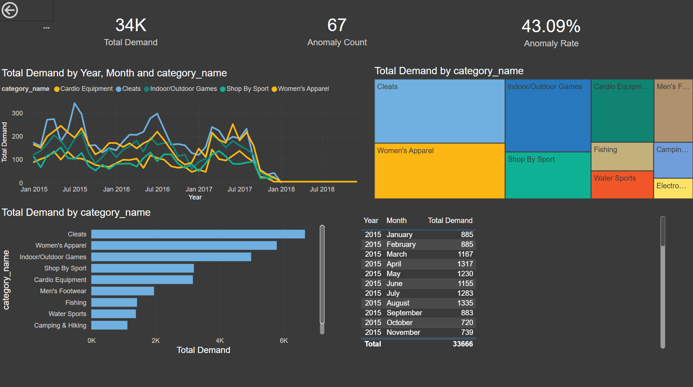
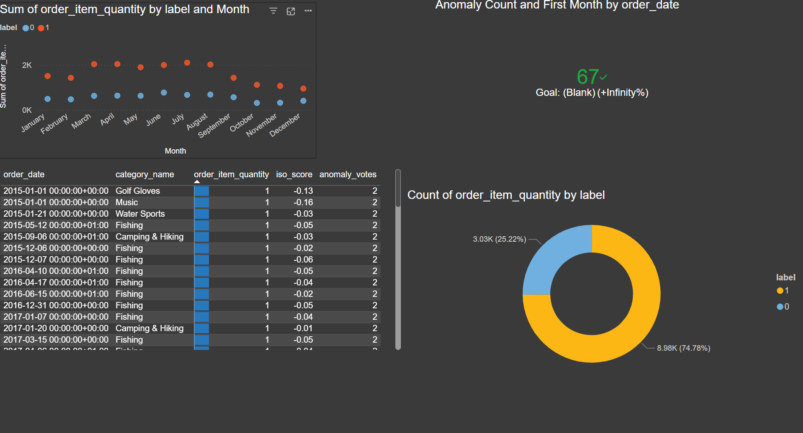
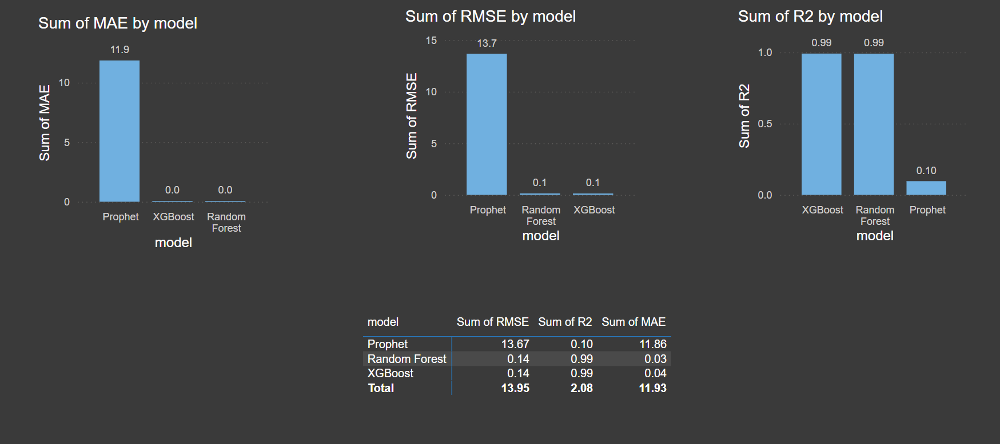

# Supply Chain Demand Forecasting & Anomaly Detection

A data science project applying machine learning and statistical analysis to real-world logistics data to forecast demand and detect supply chain anomalies.

---

## Project Overview

This project covers the end-to-end data science workflow applied to a logistics dataset:

- Forecast demand using time-series (Prophet) and ensemble models (Random Forest, XGBoost)
- Detect anomalies in shipment data using Isolation Forest, Z-Score, IQR, and DBSCAN
- Validate findings with statistical analysis in R (ARIMA, correlation, stationarity tests)
- Visualise insights through a Power BI dashboard

---

## Repository Structure

```
supply-chain-ml/
├── data/                        # Raw and processed datasets (gitignored)
│   ├── cleaned_data.csv
│   ├── detected_anomalies.csv
│   └── model_results.csv
│
├── python/                      # Python ML pipeline
│   ├── 01_data_preprocessing.py
│   ├── 02_demand_forecasting.py
│   ├── 03_anomaly_detection.py
│   ├── 04_model_evaluation.py
│   ├── models/                  # Saved trained models (.pkl)
│   └── requirements.txt
│
├── R/                           # R statistical analysis
│   ├── analysis.R
│   └── requirements.R
│
├── dashboards/                  # Power BI dashboard files
│   ├── powerbi/
│   │   ├── supply_chain_dashboard.pbix
│   │   └── supply_chain_dashboard.pdf
│   ├── screenshots/
│   └── powerbi_guide.md
│
└── README.md
```

---

## Tech Stack

| Tool | Purpose |
|---|---|
| Python | ML pipeline, feature engineering, model training |
| R | Statistical analysis, ARIMA forecasting, correlation analysis |
| scikit-learn | Random Forest, Isolation Forest, DBSCAN |
| XGBoost | Gradient boosted regression |
| Prophet | Time-series demand forecasting |
| Power BI | Interactive KPI & anomaly reporting dashboards |
| GitHub | Version control |

---

## Dataset

**Source:** [Logistics Supply Chain Real World Data — Kaggle](https://www.kaggle.com/datasets/pushpitkamboj/logistics-data-containing-real-world-data)

Download the dataset and place the CSV file in the `data/` folder, renaming it to `logistics_data.csv`.

---

## Getting Started

### 1. Clone the Repository

```bash
git clone https://github.com/briansantoso-eng/supply-chain-ml.git
cd supply-chain-ml
```

### 2. Install Python Dependencies

```bash
python -m venv venv
venv\Scripts\activate
pip install -r python/requirements.txt
```

### 3. Install R Dependencies

```r
source("R/requirements.R")
```

### 4. Download the Dataset

Go to the [Kaggle dataset](https://www.kaggle.com/datasets/pushpitkamboj/logistics-data-containing-real-world-data), download and place the CSV at `data/logistics_data.csv`.

### 5. Run the Python Pipeline (in order)

```bash
cd python
python 01_data_preprocessing.py
python 02_demand_forecasting.py
python 03_anomaly_detection.py
python 04_model_evaluation.py
```

### 6. Run R Analysis

```r
source("R/analysis.R")
```

R produces statistical outputs to complement the Python ML results:

| Output | Description |
|---|---|
| `R_distribution.png` | Distribution of order quantities |
| `R_time_series.png` | Demand trend with LOESS smoothing |
| `R_arima_forecast.png` | ARIMA 30-period forecast |
| `R_category_breakdown.png` | Top 15 categories by demand |
| `R_correlation.png` | Feature correlation matrix |
| `R_anomaly_distribution.png` | Z-score anomaly distribution |

### 7. Open the Dashboard

Open `dashboards/supply_chain_dashboard.pbix` in Power BI Desktop, or follow `dashboards/powerbi_guide.md` to build it from scratch.

---

## Key Results

| Model | MAE | RMSE | R² |
|---|---|---|---|
| Random Forest | 0.03 | 0.14 | 0.99 |
| XGBoost | 0.04 | 0.14 | 0.99 |
| Prophet | 11.86 | 13.67 | 0.10 |

**Anomalies detected:** 67 records flagged across 4 detection methods (anomaly rate: 43%).

Random Forest and XGBoost significantly outperform Prophet on this dataset. Prophet underperforms because demand patterns here are feature-driven rather than purely time-series — ensemble models that incorporate product category, seasonality features, and order attributes achieve near-perfect R² of 0.99.

---

## Power BI Dashboard

**Download:** [supply_chain_dashboard.pbix](dashboards/powerbi/supply_chain_dashboard.pbix) | [supply_chain_dashboard.pdf](dashboards/powerbi/supply_chain_dashboard.pdf)

### Page 1 — Executive Summary



### Page 2 — Anomaly Report



### Page 3 — ML Model Comparison



---

## Outputs

After running the full pipeline, the `data/` folder will contain:

- `cleaned_data.csv` — preprocessed dataset
- `detected_anomalies.csv` — records flagged as anomalies
- `model_results.csv` — model performance comparison
- `prophet_forecast.png` — Prophet forecast chart
- `feature_importance.png` — Random Forest feature importances
- `anomaly_scatter.png` — anomaly scatter plot
- `model_comparison.png` — model metrics bar chart
- `R_*.png` — R-generated statistical charts

---

## Author

**Brian Santoso**

- GitHub: [briansantoso-eng](https://github.com/briansantoso-eng)
- LinkedIn: [brian-santoso](https://www.linkedin.com/in/brian-santoso/)

---

## License

This project is licensed under the MIT License.
